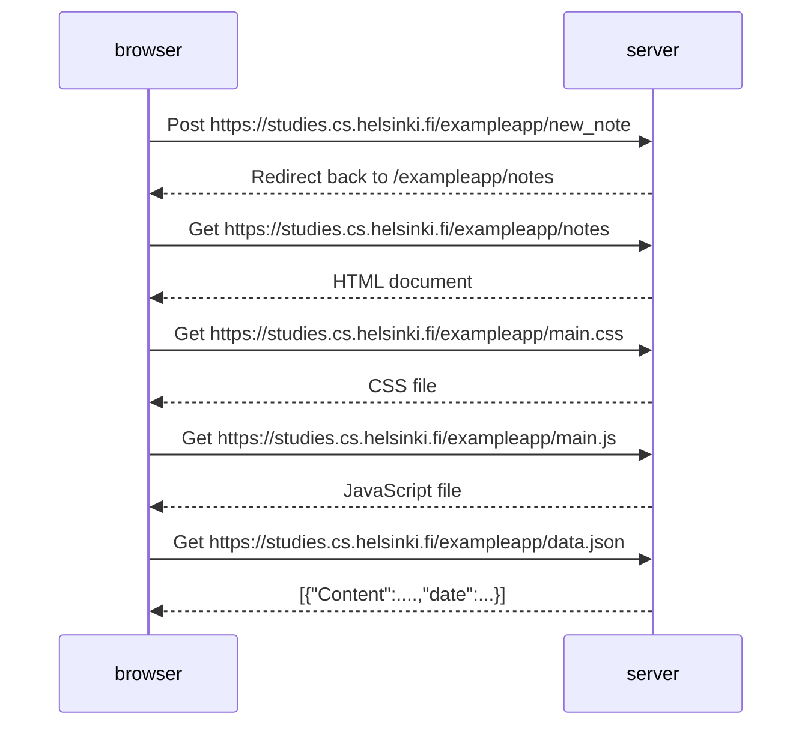

Answer for 0.4: New note diagram exercise. 

```mermaid
sequenceDiagram;


browser->>server: Post https://studies.cs.helsinki.fi/exampleapp/new_note
server-->>browser: Redirect back to /exampleapp/notes

browser->>server: Get https://studies.cs.helsinki.fi/exampleapp/notes
server-->>browser: HTML document

browser->>server: Get https://studies.cs.helsinki.fi/exampleapp/main.css
server-->>browser: CSS file

browser->>server: Get https://studies.cs.helsinki.fi/exampleapp/main.js
server-->>browser: JavaScript file

browser->>server: Get https://studies.cs.helsinki.fi/exampleapp/data.json
server-->>browser: [{"Content":....,"date":...}]


```